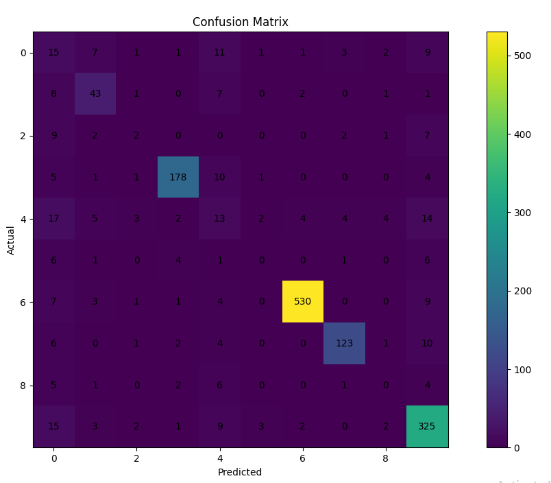
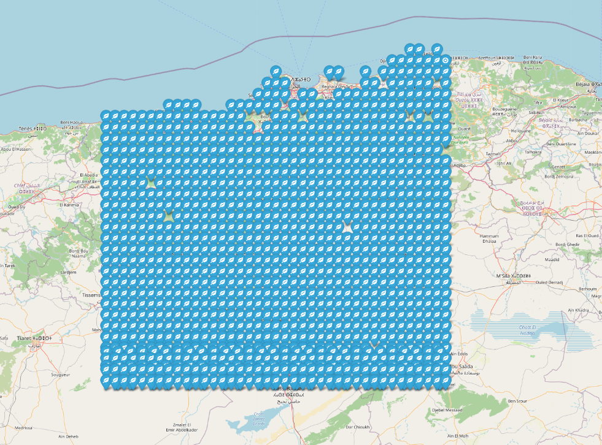

# 🌱 Agro Data Pipeline & Crop Recommendation System

## 📌 Overview

This project is composed of **two main programs** that work together to:

1. **Collect agricultural data (weather + soil) for Algeria**
2. **Train a Machine Learning model to recommend crops**
3. **Visualize the results on an interactive map**

---

## 🧭 System Architecture Diagram

```
                ┌────────────────────────────┐
                │   Kaggle Dataset Loader    │
                └────────────┬───────────────┘
                             │
                             ▼
                ┌────────────────────────────┐
                │ Training Dataset (CSV)     │
                └────────────┬───────────────┘
                             │
                             ▼
┌────────────────────────────────────────────────────────────┐
│                 MACHINE LEARNING PIPELINE                  │
│                                                            │
│  Data Cleaning → Feature Engineering → Model Training       │
│                  → Evaluation → Prediction                  │
└────────────────────────────┬───────────────────────────────┘
                             │
                             ▼
                ┌────────────────────────────┐
                │  Crop Recommendation Model │
                └────────────┬───────────────┘
                             │
                             ▼
┌────────────────────────────────────────────────────────────┐
│                ASYNC DATA COLLECTION PIPELINE              │
│                                                            │
│   Grid نقاط → Weather Agent + Soil Agent → Merge Data      │
│                → Algeria Dataset (CSV)                     │
└────────────────────────────┬───────────────────────────────┘
                             │
                             ▼
                ┌────────────────────────────┐
                │ Prediction + Map (Folium)  │
                └────────────────────────────┘
```

---

This project is composed of **two main programs** that work together to:

1. **Collect agricultural data (weather + soil) for Algeria**
2. **Train a Machine Learning model to recommend crops**
3. **Visualize the results on an interactive map**

The system follows a pipeline architecture:

```
Data Fetching → Data Cleaning → Model Training → Prediction → Visualization
```

---

## ⚙️ Program 1: Data Fetching (Async Pipeline)

### 🔄 Agent Interaction Diagram

```
          ┌───────────────┐
          │  Coordinates  │
          └──────┬────────┘
                 │
     ┌───────────▼────────────┐
     │    process_point()     │
     └───────┬────────┬───────┘
             │        │
     ┌───────▼───┐ ┌──▼────────┐
     │ Weather   │ │   Soil     │
     │  Agent    │ │   Agent    │
     └───────┬───┘ └──┬────────┘
             │          │
     Open-Meteo API   SoilGrids API
             │          │
             └──────┬───┘
                    ▼
           ┌────────────────┐
           │ Merged Features│
           └────────────────┘
```

File: `fetch_alg_dataframe.py`


### 🎯 Purpose

This program builds a dataset for Algeria by collecting:

* 🌦 Weather data (temperature, humidity, rainfall)
* 🌱 Soil data (pH, nitrogen, carbon, etc.)

### 🧠 Architecture

The pipeline is **asynchronous** and uses an **agent-based design**:

#### 1. Weather Agent

* Fetches historical weather data from **Open-Meteo API**
* Computes:

  * Average temperature
  * Average humidity
  * Total rainfall

#### 2. Soil Agent

* Fetches soil properties from **SoilGrids API**
* Extracts:

  * Soil pH
  * Nitrogen
  * Organic Carbon
  * CEC (used to estimate Potassium)
* Derives **Soil Type** (Sandy, Clay, Silt, Loamy)

#### 3. Orchestrator (`process_point`)

* Runs both agents **in parallel** using `asyncio.gather`
* Merges results into a single data row

---

### ⚡ Performance Optimization

* Uses **asyncio + aiohttp** for concurrency
* **Batch processing** to control load
* **Retry mechanism** for API failures (429, timeout, etc.)
* **Semaphore & Lock**:

  * Limits weather API concurrency
  * Protects soil API from rate limits

---

### 📍 Grid Sampling

The system scans Algeria using coordinates:

* Latitude range
* Longitude range
* Step size controls resolution

Each coordinate = one agricultural data point

---

### 💾 Output

The result is saved as:

```
data/mid_algeria_agro_data.csv
```

Each row contains:

* Location (lat, lon)
* Weather features
* Soil features

---

## 🤖 Program 2: Crop Recommendation Model

File: `trainingCode.py`

### 🧠 ML Pipeline Diagram

```
        Raw Dataset
             │
             ▼
     Data Cleaning
             │
             ▼
   Feature Preparation
             │
             ▼
   Train/Test Split
             │
             ▼
   Random Forest Model
             │
             ▼
   Evaluation Metrics
             │
             ▼
   Predictions (Algeria)
```

File: main ML script

### 🎯 Purpose

Train a model to recommend the best crop based on environmental conditions.

---

### 🧹 Step 1: Data Cleaning

#### Training Dataset

* Loaded from:

```
data/crop_remmendation_dataset.csv
```

* Operations:

  * Rename columns (N → Nitrogen, etc.)
  * Remove irrelevant features
  * Reorder columns
  * Encode categorical feature (Soil_Type)
  * Remove missing and zero values

---

### 🌲 Step 2: Model Training

Algorithm used:

```
Random Forest Classifier
```

#### Why Random Forest?

* Handles non-linear relationships
* Works well with tabular data
* Robust to noise and overfitting

#### Training Process

* 80% training / 20% testing split
* Model learns mapping:

```
(Environmental Features) → Crop Type
```

---

### 📊 Step 3: Evaluation Metrics

* **Accuracy** → overall correctness
* **F1 Score** → balance between precision & recall
* **Specificity** → true negative rate per class
* **Confusion Matrix** → detailed class performance

A visualization of the confusion matrix is also generated.

---

### 🌍 Step 4: Apply Model on Algeria Data

Input:

```
data/mid_algeria_agro_data.csv
```

Processing:

* Clean dataset
* Encode soil types (same encoder as training)
* Remove coordinates before prediction

Output:

```
data/algeria_crop_recommendations.csv
```

Each row now includes:

```
recommended_crop
```

---

### 🗺 Step 5: Visualization

* Uses **Folium** to generate an interactive map
* Each location is marked with:

  * Crop recommendation
  * Icon representing crop type

Output:

```
src/algeria_crop_map.html
```

---

## 🔄 How Everything Connects

```
1. Run crop_dataframe.py
   ↓
2. load traning dataset from kaggle
   ↓   
3. Run fetch_alg_dataframe.py
   ↓
4. Generate Algeria dataset
   ↓
5. Run ML script
   ↓
6. Train model
   ↓
7. Predict crops for Algeria
   ↓
8. Generate map visualization
```

---

## 📥 Kaggle Dataset Loader

File: `crop_dataframe.py`

Before training, download the dataset.


---

## 🖼 Example Outputs (Screenshots)

### 📊 Confusion Matrix




### 🗺 Crop Recommendation Map




---

## 🚀 How to Run

### Step 1 — Fetch Data

```
python crop_dataframe.py
python fetch_alg_dataframe.py
```

### Step 2 — Train Model & Predict

```
python trainingCode.py
```
### Step 3 — crop map

```
better install live server extension
right click on the file and select the extension algeria_crop_map.html
```

---

## ⚠️ Notes

* APIs may return **429 (rate limit)** → handled automatically
* Soil data is slower due to strict rate limiting
* Dataset resolution depends on `STEP_SIZE`

---

## 📌 Key Concepts Used

* Asynchronous Programming (`asyncio`)
* API Integration
* Data Cleaning & Preprocessing
* Machine Learning (Random Forest)
* Geospatial Visualization (Folium)

---

## 📈 Future Improvements

* Add more environmental features (wind, sunlight)
* Improve soil nutrient estimation accuracy
* Use more advanced models (XGBoost, Neural Networks)
* Deploy as a web application

---

## 👨‍💻 Author

Student project focused on **AI for Agriculture in Algeria**.

---

## 📦 Installation & Usage
1. Clone the repository:
   ```bash
   git clone https://github.com/tahar-irki/Algeria-AgroData-Pipeline.git

If you found this useful, feel free to ⭐ the repository.
